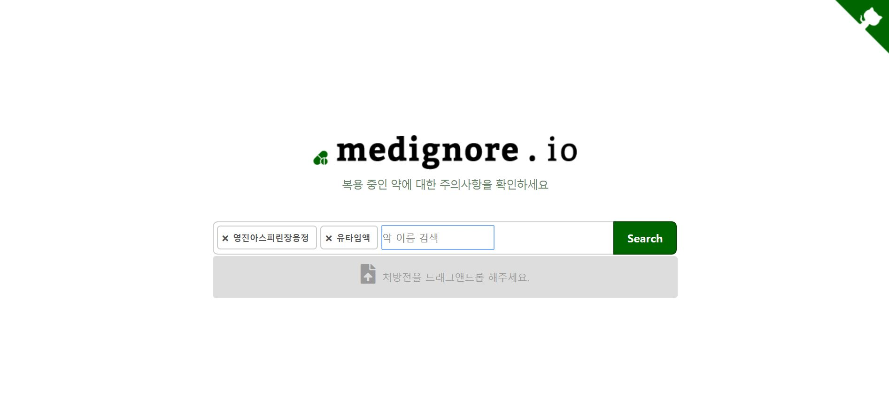
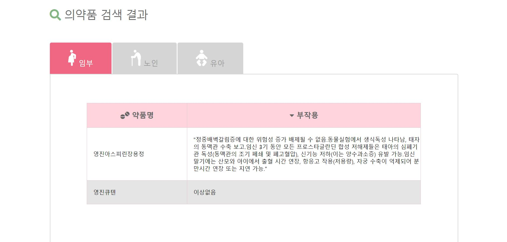

<h1></h1>
 

## What is this?

> Drug Precautions Retrieval Service

### Function

* drug search (search index, multiple search)
* Prescription Image Drag & Drop Function
  * Extraction of codes in the prescription using OCR API
  * Convert the codes to drug name using Json parsing
* Show cautions for medicines


## Stack

> Front-end

* Vue.js
* Boostrap4
* HTML5 / CSS3 / JavaScript / jQuery / Ajax

> Back-end

* Django 2.2.7
* python 3.7.4
* SQLite


## Installation

1. https://github.com/kyun9/Medignore.git  - [Clone or download] - ["Click"]

   

## Usage

1. Create a python virtual environment

   ```bash
   $ python -m venv venv
   $ source ./venv/Scripts/activate
   ```

2. Adding python package

   ```bash
   $ pip install -r requirements.txt
   ```

3. Apply Migration

   ```bash
   $ python manage.py migrate
   ```

4. Create .env file

   ```
   DATA_API_SERVICEKEY="{DATA_API_SERVICEKEY}"
   
   #KAKAO_VISION_API_KEY
   KAKAO_KEY="{KAKAO_KEY}"  
   ```

5. Running a server

   ```bash
   $ python manage.py runserver
   ```


## Screenshots





